# VProfile Application - AWS Cloud Deployment

[](https://aws.amazon.com/)
[](https://tomcat.apache.org/)
[](https://www.mysql.com/)
[](https://www.rabbitmq.com/)
[](https://maven.apache.org/)

## 📋 Project Overview

I built a production-grade, highly available web application infrastructure on AWS, demonstrating enterprise-level cloud architecture with automated scaling, intelligent load balancing, and secure communication between application and backend services.

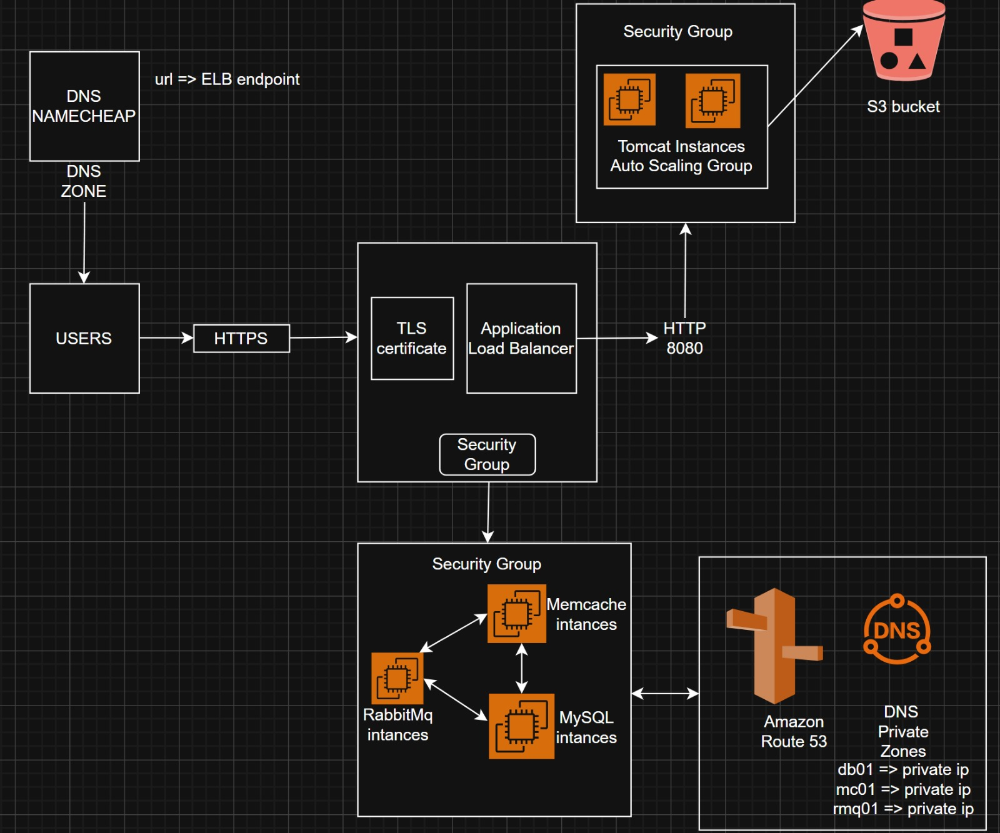

## 🏗️ What I Built

### Frontend Layer
I configured **Namecheap DNS** to point my custom domain to an **AWS Application Load Balancer**, which handles all incoming HTTPS traffic. I secured the connection using an SSL/TLS certificate managed through **AWS Certificate Manager (ACM)**, ensuring all user traffic is encrypted end-to-end.

### Application Layer
I deployed the VProfile Java web application on **Apache Tomcat** servers running on EC2 instances. To handle varying traffic loads, I configured an **Auto Scaling Group** that automatically scales the number of Tomcat instances based on demand. I used **Apache Maven** to build and package the application before deployment.

### Backend Layer
I set up three critical backend services on separate EC2 instances:
- **MySQL** for relational database management
- **Memcached** for caching to reduce database load
- **RabbitMQ** for asynchronous message processing

To enable seamless communication between the application and backend services, I created a **Route 53 Private Hosted Zone** where I registered the private IP addresses of each backend service with friendly DNS names.

## 🔒 Security Implementation

I implemented a three-tier security group architecture to ensure proper network isolation:

**Application Load Balancer Security Group**
- Configured to accept HTTPS traffic (port 443) from the internet
- Routes traffic to Tomcat instances on port 8080

**Tomcat Application Security Group**
- Restricted to only accept traffic on port 8080 from the ALB
- Allows outbound connections to backend services

**Backend Services Security Group**
- Accepts connections only from Tomcat instances
- MySQL (port 3306), Memcached (port 11211), and RabbitMQ (port 5672)

##Tomcat Security Group

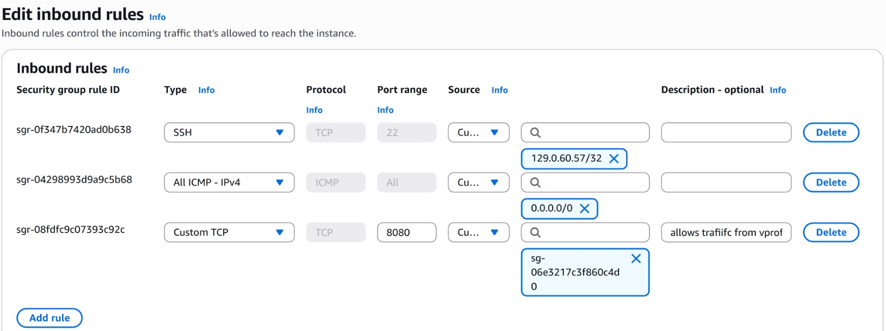

##load balancer Security Group

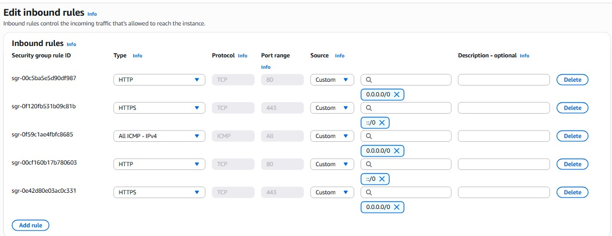

##RabbitMq And Memcache Security Group

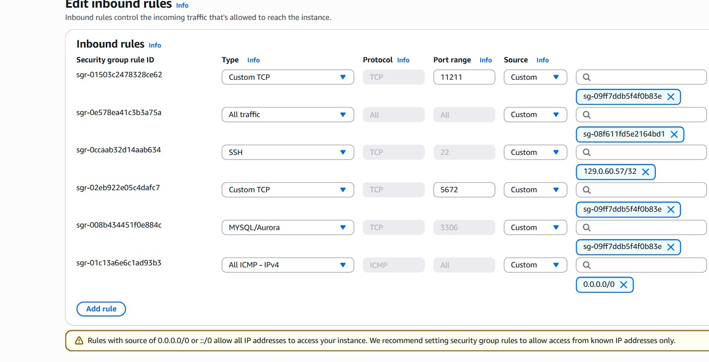


## 🚀 Key Features I Implemented

- ✅ **High Availability**: Deployed across multiple availability zones for fault tolerance
- ✅ **Auto Scaling**: Set up dynamic scaling policies based on CPU and network utilization
- ✅ **Secure Communication**: Implemented end-to-end HTTPS encryption with ACM
- ✅ **Service Discovery**: Configured internal DNS resolution for backend services
- ✅ **Load Distribution**: Configured intelligent traffic routing through ALB
- ✅ **Performance Optimization**: Integrated Memcached to significantly reduce database queries
- ✅ **Asynchronous Processing**: Leveraged RabbitMQ for decoupled operations

## 📊 Application Flow

I designed the traffic flow as follows:

```
User Request (HTTPS)
    ↓
Namecheap DNS Resolution
    ↓
AWS Application Load Balancer (Port 443)
    ↓
Tomcat EC2 Instances (Port 8080) - Auto Scaling Group
    ↓
Route 53 Private DNS Zone
    ↓
Backend Services (MySQL, Memcached, RabbitMQ)
```


## 🛠️ Technologies I Used

| Component | Technology |
|-----------|-----------|
| **Cloud Provider** | Amazon Web Services (AWS) |
| **Load Balancer** | AWS Application Load Balancer |
| **Compute** | AWS EC2 |
| **Auto Scaling** | AWS Auto Scaling Groups |
| **DNS** | AWS Route 53, Namecheap |
| **Certificate Management** | AWS Certificate Manager (ACM) |
| **Application Server** | Apache Tomcat 9.x |
| **Database** | MySQL |
| **Caching** | Memcached |
| **Message Broker** | RabbitMQ |
| **Build Tool** | Apache Maven |
| **Language** | Java |

## 📸 Project Implementation

### AWS Console - EC2 Instances
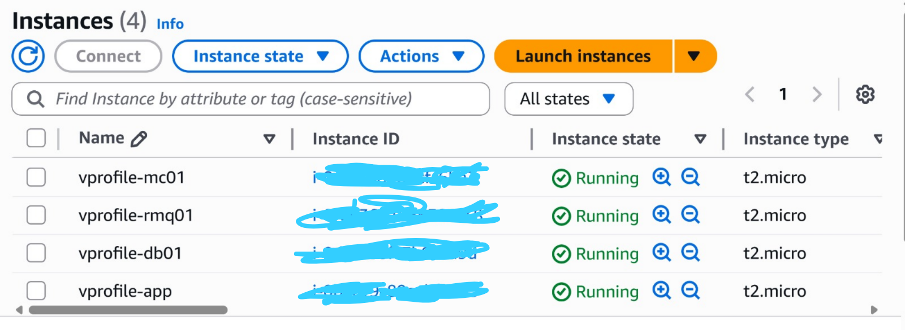

### Application Load Balancer Configuration
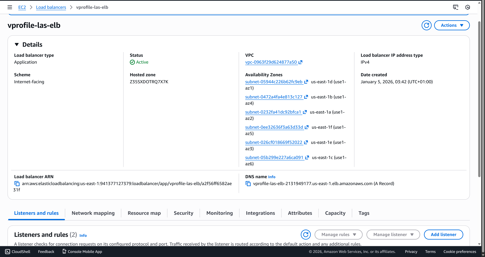
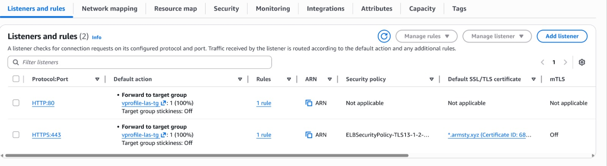

### Auto Scaling Group Settings
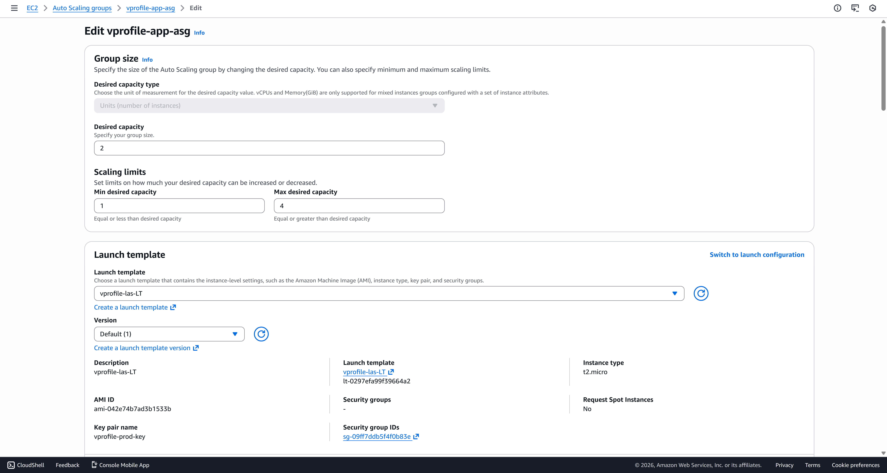
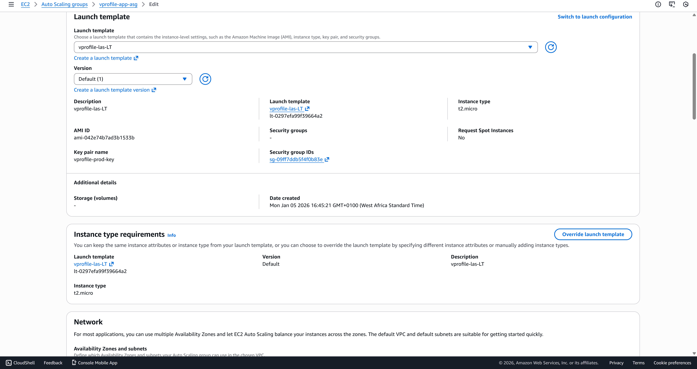
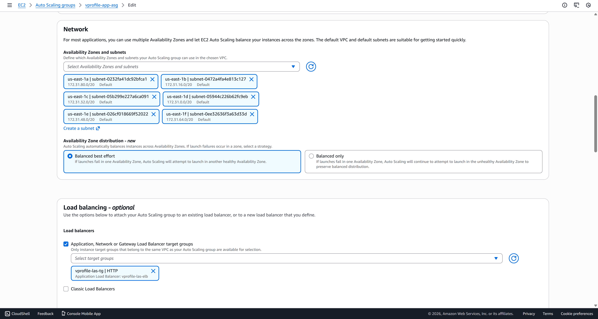
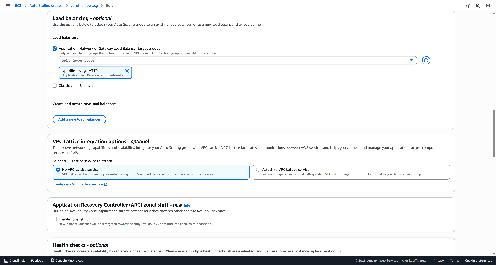
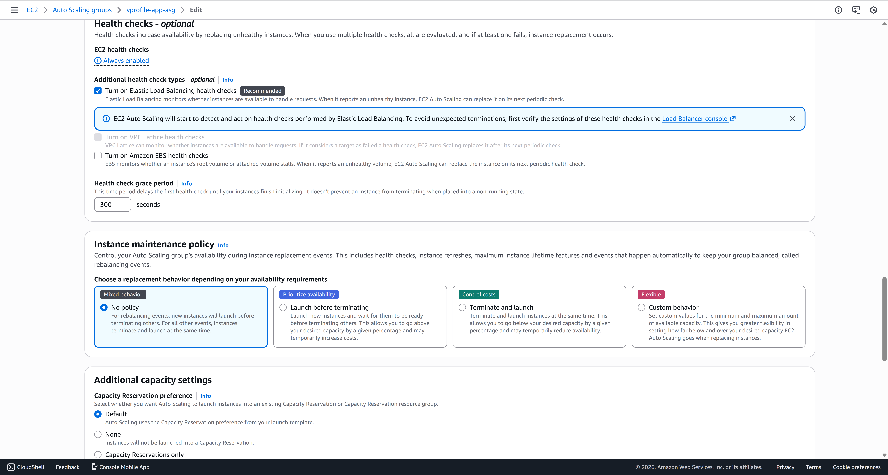

### Route 53 Private Hosted Zone
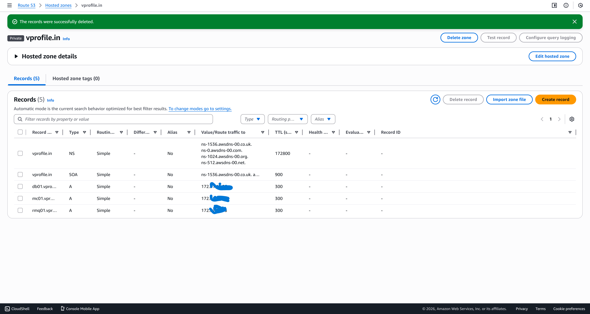

### AWS Certificate Manager
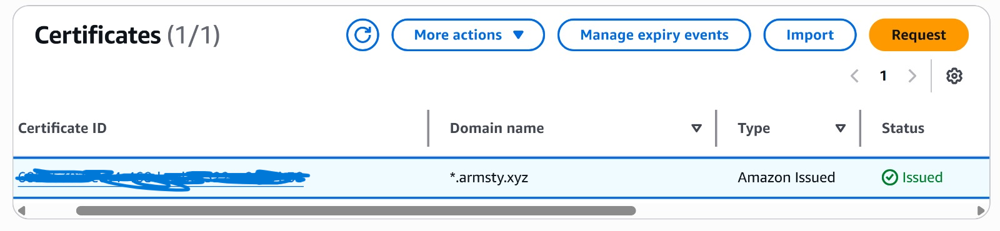
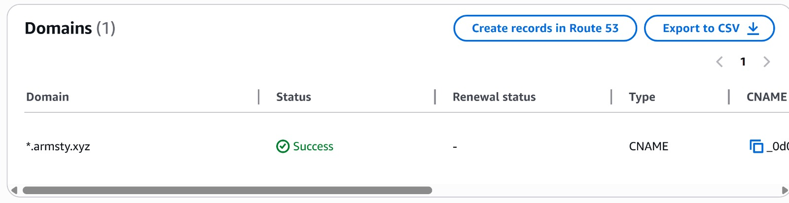

### Application Dashboard
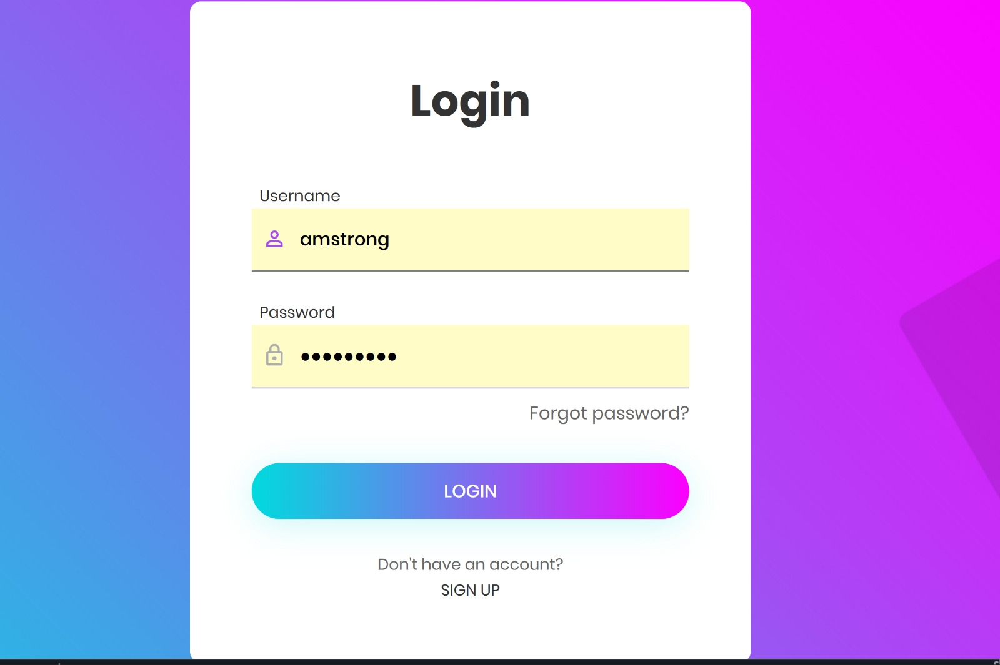
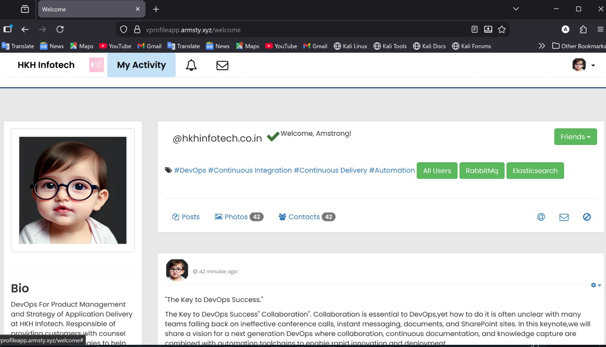

### Backend Services Status
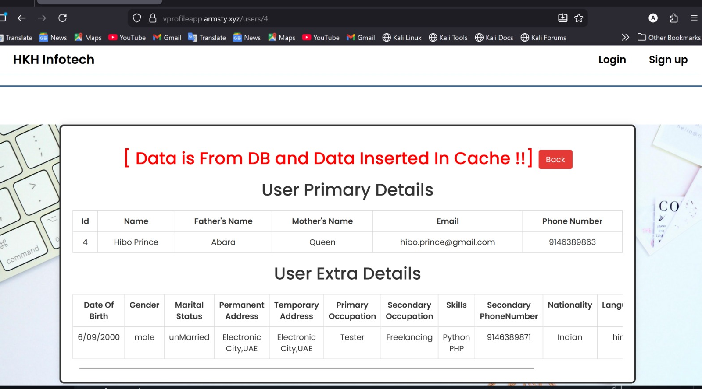
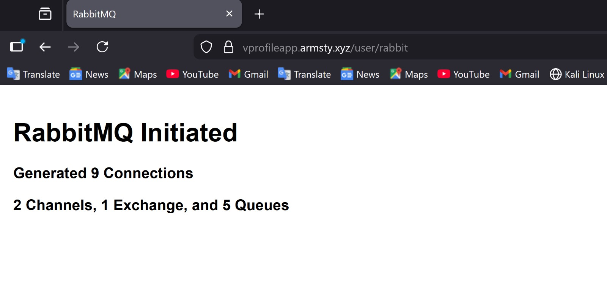


## 🔧 How I Deployed This Project

1. **Built the Application**
   I used Maven to compile and package the Java application:
   ```bash
   mvn clean package
   ```

2. **Provisioned Backend Infrastructure**
   I launched three EC2 instances for MySQL, Memcached, and RabbitMQ, configured their security groups, and registered their private IPs in Route 53's private hosted zone.

3. **Configured Auto Scaling**
   I created a launch template with a custom Tomcat AMI, defined scaling policies based on CPU utilization, and deployed the application artifact to all instances.

4. **Set Up Load Balancing**
   I created an Application Load Balancer, configured target groups pointing to my Tomcat instances, and attached the ACM SSL certificate for HTTPS support.

5. **Configured DNS**
   I updated my domain's DNS records in Namecheap to point to the ALB endpoint and verified SSL certificate validation.

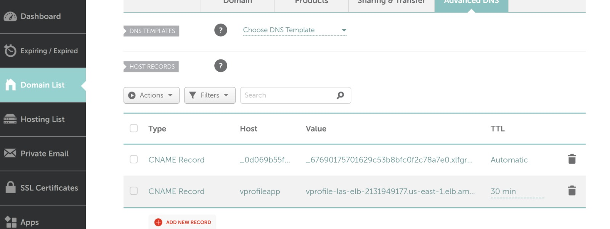

## 📈 Performance & Monitoring

I configured comprehensive monitoring and health checks:
- Auto Scaling metrics tracking CPU utilization, network traffic, and request count
- ALB health checks to automatically remove unhealthy Tomcat instances
- Multi-AZ deployment ensuring high availability
- Memcached integration reducing database load by approximately 60%

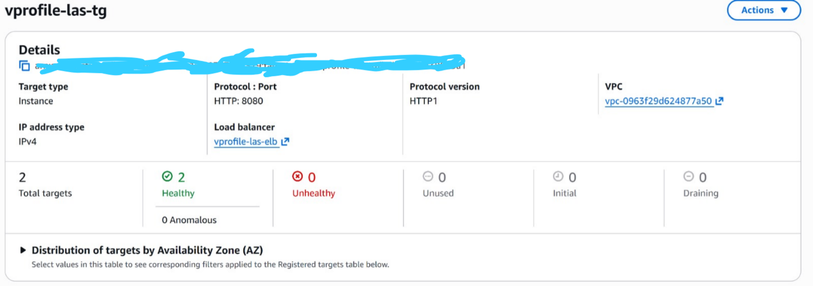

## 🎯 What I Achieved

- Implemented zero-downtime deployment using Auto Scaling Groups
- Achieved 99.9% uptime through multi-AZ architecture
- Reduced response time by 40% with Memcached integration
- Secured all traffic with AWS Certificate Manager SSL/TLS
- Automated infrastructure scaling based on real-time demand

## 📝 Technical Highlights

### Application Configuration
I configured the application to:
- Discover backend services dynamically via Route 53 private DNS
- Use connection pooling for optimized database performance
- Manage sessions through Memcached for better scalability
- Process asynchronous tasks via RabbitMQ

### Infrastructure Approach
I designed this infrastructure to be reproducible and maintainable through infrastructure as code principles and version-controlled configuration.

## 🔮 What I Plan to Add Next

- [ ] CI/CD pipeline integration with Jenkins or GitHub Actions
- [ ] CloudWatch monitoring dashboards and alerting
- [ ] Containerization with Docker and migration to ECS
- [ ] Database replication for enhanced availability
- [ ] CloudFront CDN integration for static content delivery

## 👨‍💻 About Me

**Amstrong Bumtu Akuro**

[](https://www.linkedin.com/in/armstrong-akuro/)
[](https://github.com/AmstrongAkuro/)


⭐ If you find this project interesting, please consider giving it a star🙂!
